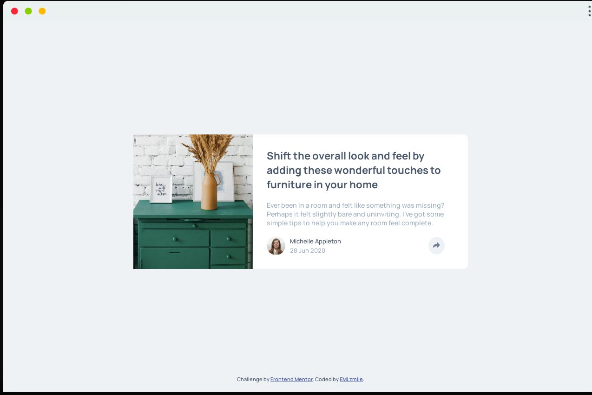

# Frontend Mentor - Article preview component solution

This is a solution to the [Article preview component challenge on Frontend Mentor](https://www.frontendmentor.io/challenges/article-preview-component-dYBN_pYFT). Frontend Mentor challenges help you improve your coding skills by building realistic projects. 

## Table of contents

- [Overview](#overview)
  - [The challenge](#the-challenge)
  - [Screenshot](#screenshot)
  - [Links](#links)
- [My process](#my-process)
  - [Built with](#built-with)
  - [What I learned](#what-i-learned)
- [Author](#author)


## Overview

### The challenge

Users should be able to:

- View the optimal layout for the component depending on their device's screen size
- See the social media share links when they click the share icon

### Screenshot



### Links

- Solution URL: [GitHub solution](https://github.com/EMLzmile/article-preview-component)
- Live Site URL: [Live Solution](https://emlzmile.github.io/article-preview-component/)

## My process

### Built with

- Semantic HTML5 markup
- CSS custom properties
- Flexbox
- Mobile-first workflow
- [Font-family Manrope](https://fonts.google.com/specimen/Manrope) - For styles

### What I learned

I make my first tips

```css
.share::after{
  content: "";
  position: absolute;
  right: calc(50% - 30px);
  bottom: 0;
  display: block;
  border: 1rem solid transparent;
  border-top-color: var(--verydark-grayish-blue);
  transform: translate(-50%, 100%);
}
```

## Author

- GitHub - [@EMLzmile](https://github.com/EMLzmile)
- Frontend Mentor - [@EMLzmile](https://www.frontendmentor.io/profile/EMLzmile)
- Codewars - [@EMLzmile](https://www.codewars.com/users/EMLzmile)
- Facebook - [@Emmanuel Moolongawi](https://m.facebook.com/emmanuel.moolongawi)
